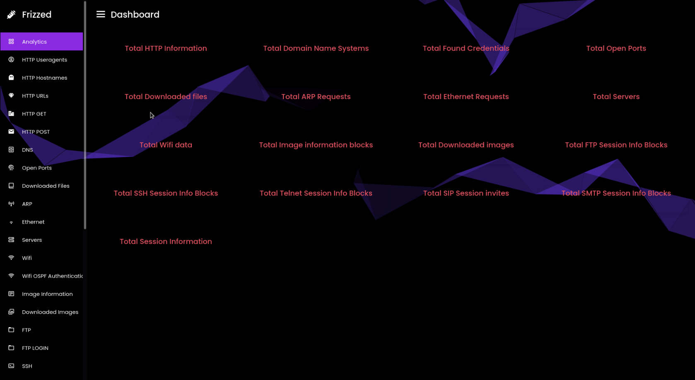

<p align="center">
  
</p>

### Frizz subinfo ### 

Version -> 0.0.1 (BETA)

# What is frizz 

Frizz is a newer more modern NFAT with multiple features! Being new to the game frizz can do many things but mainly sides with offensive security experts. Frizz does not just decode layers but decodes layers for specific information such as credentials, base64 and base32 logins, usernames, emails,
email chats, phone numbers, dial information, HTTP information and much more amongst that list. Frizz uses a series of regular expression algorithms along with the side of raw decoders in both C++ and Go to decode information that will be wanted by an everyday user. Frizz is not like any other NFAT where it just will output information on a terminal, or output it to a XML, JSON even CSV file but with the power of crystal starts a local HTTP server filled of indexes and HTML files holding the information that was parsed even providing analytics on that section. Frizz is super fast and even allows the user to input a list of directories to pcap files for example 

```
example/path/to/pcap/pcap0cap
example/path/to/pcap/pcap6pcap
example/path/to/pcap/pcap5pcap
example/path/to/pcap/pcap4pcap
example/path/to/pcap/pcap3pcap
example/path/to/pcap/pcap2pcap
example/path/to/pcap/pcap1pcap
```

and will mash all of the packets into one file and parse them all at once. With tools like this in beta already frizz is for sure to give you a fun experience

# Comming soon 

Frizz will after beta come with new features such as network parsers, the ability to export data in XML, HTML, JSON, YAML etc formats, view images, decode images and check for viruses or check for certain signatures in files, use the browser to automate certain network data and may even use databases such as Phone code, IP code, MAC address ( OUI ) and even port and service databases to test the true sense of a host or address. 

Frizz will soon be a monitized program with features like that, however with the features and everything that will come with it it is certainly worth the money you will pay for it! Of course this is later on and the more you get into it the more complex the program will be. But it is for sure worth it!


# Supported protocols 

| Protocol | Decoding form | 
| -------- | ------------- | 
| IMAP     | Payload |
| SMTP     | Payload | 
| FTP      | Decoder | 
| ARP      | Decoder |
| ETHERNET | Decoder | 
| HTTP     | Decoder | 
| Dot11    | Decoder | 
| UDP      | Decoder | 
| Telnet   | Decoder |
| SIP      | Decoder | 


# Features 


# Comparing 


This project was almost a direct inspiration from apackets. I felt with how closed sourced and over priced apackets were for its minimal features i can do better and charge less while also partly making it open source. Here is a simple compare of apackets to frizz 

| Apacket status and information | Frizz features, status and information | 
| ------------------------------ | -------------------------------------- | 
| Limited packet uploading and parsing limit | No limit to packet parsing or uploading | 
| Upwards to 200$ a month for extra storage space but no features | Free and open source ( for now but will never be 200$ a month ) | 
| Only supports 19 packet parsing tabs | Supports over 35+ Protocols and individual tabs | 
| Unclean and sometimes messy and gltichy dashboard | Cleaner, more modern and performant dashboard | 
| Slower at packet parsing sometimes can take 15 to 20 seconds on average sometimes a full minute | Parses up to 300,000 packets of different layers in under a few seconds | 
| Pre generated templates | New and freshly imported and generated templates | 
| No packet mashing | Allows users to take a list of pcap files, mash them into one and even output the results | 
| Need to be online or have network to run it | Do not need to have access to network connections to run it, runs on localhost | 
| Unsafe and sometimes laggy | Safer with handleing exceptions for networking information | 
| Does not allow users to customize background of dashboard | Allows users to customize the colors and color code sof the dashboard | 
| Does not allow custom user filepath or pre settings with YAML or even JSON | Allows users to pre specify server verbosity options, load server config files and more | 
| Older and less stable | More modern and appealing | 
| No signature checking, older databases of OUI's etc | Constantly updated port service names databases, OUI databases, signature databases for either payloads or regex to verify certain packet signatures | 
| Not so specific for data | Has tabs specified for certain information such as SIP invites, SSH messages and codes, FTP messgaes and code, certain authentication, statistics, HTTP parts, hostnames, servers, ports, POP3 IP's, MACS, Emails, To and FROM | 


# Implimentation 

| Feature to impliment in other versions | Paid or no | Description | 
| -------------------------------------- | ---------- | ----------- | 
| Export data in XML, HTML, JSON and YAML | No | Allows the user to export certain data as XML, JSON, HTML table, YAML or even CSV in the further future 
| Databases such as GEO-IP, GEO-MAC, MAC_OUI, Phone region, Net info, Port | Yes and no | Some of these databases will be implimneted for free but will not have full use ability unless the license is free | 
| File checks | Yes | When a file is downloaded, reconstructed or re wired from certain images and certain points this will need to be paid for, basically this feature will take those same files and scan the files for a few things such as its header, viruses, hidden files such as archive files, hidden messages, base64 encoded strings, base32 encoded strings, AES encoded strings etc | 
| Geo MAP of all connections or geoIPs | yes | this is a feature that will be supper hard to impliment given the JS needed will need to be pre generated so will the phone numbers and logos, however this can still easily be done but will be a paid feature due to the work | 
| WHOIS, Geo etc online and offline tools | yes | this will be a paid for feature because it gives the user access to premium whois tools which will drop very valuable information using certain engines and even custom made libraries like geo location, records, domain records, base records, ip information etc | 
| Email and other various data parsing databases | yes and no | throughout the entire program i want to impliment something that will make people go wow and to do that i will be implimenting some email checking databases but will only leave certain more accurate email, phone number, IP, mac etc databases up to premium users
